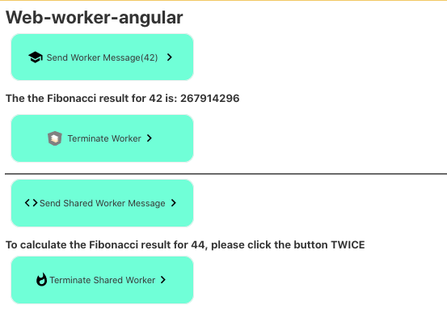

# Description the Application

This application efficiently computes Fibonacci numbers through the utilization of both Web Workers and Shared Workers. This approach ensures rapid results by capitalizing on parallel processing threads. Without employing this technique, direct calculations would incur significant timeouts. 

To experience the enhanced performance, you can uncomment the line __generateFibonacci0(45);__ in the __app.component.ts__ file.

[Deploy](https://651d6356d736b66ccaeb8799--serene-yeot-845c79.netlify.app/)

## Used materials:

https://www.notion.so/Docs-and-materials-in-English-Docs-web-worker-f0167d0337f141a4a5147af4d0a8c930

https://angular.io/guide/web-worker
https://angdev.ru/archive/angular9/web-workers/
https://developer.mozilla.org/en-US/docs/Web/API/Web_Workers_API

!!!!!!!!!
https://youtu.be/ctKmHO2yARY?t=602
https://slides.com/sergeymell/fwdays-2018

https://youtu.be/nC-ZL5albhw 

https://youtu.be/2ry0OsfJtSM
https://youtu.be/0mw9emMmiJs
https://youtu.be/ZqjDBxt8DYo 

https://youtu.be/m_lBrlE3dhw

### Node.js
https://youtu.be/ho1JEZ5AXjg
https://nodejs.org/api/worker_threads.html
https://nodejs.org/api/events.html

# web-worker-angular

This project was generated with [Angular CLI](https://github.com/angular/angular-cli) version 16.1.1.

## Development server

Run `ng serve` for a dev server. Navigate to `http://localhost:4200/`. The application will automatically reload if you change any of the source files.

## Code scaffolding

Run `ng generate component component-name` to generate a new component. You can also use `ng generate directive|pipe|service|class|guard|interface|enum|module`.

## Build

Run `ng build` to build the project. The build artifacts will be stored in the `dist/` directory.

## Running unit tests

Run `ng test` to execute the unit tests via [Karma](https://karma-runner.github.io).

## Running end-to-end tests

Run `ng e2e` to execute the end-to-end tests via a platform of your choice. To use this command, you need to first add a package that implements end-to-end testing capabilities.

## Further help

To get more help on the Angular CLI use `ng help` or go check out the [Angular CLI Overview and Command Reference](https://angular.io/cli) page.
